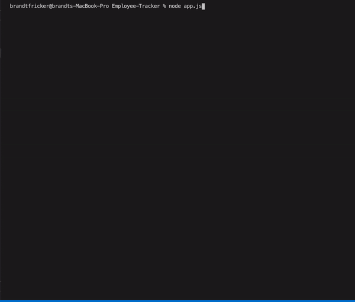

# Employee-Tracker

## Description
The Employee Tracker is a great resource for any user in a mangement position to view, add and update their departments, employees, and employee roles.  This application makes changing and keeping up to date information on their employees and departments a breeze. 

### Employee Tracker in Action!

## Table of Contents

  - [Description](#description)
  - [Installation](#installation)
  - [Usage](#usage)
  - [Repository](#repository)
  - [GitHub](#github)

## Installation

Run:

<pre>
<code>
npm i
</code>
</pre>

## Usage
This command-line application allows the user to:
* View all their employees
* View all their departments
* Add an employee, department, or employee role
* Update and employee role
The application will be invoked when a user runs the following:
<pre>
<code>
node app.js
</code>
</pre>

## Repository 
- [Project Repository](https://github.com/brandt-fricker/Employee-Tracker)

## GitHub
- [GitHub Profile](https://github.com/brandt-fricker)